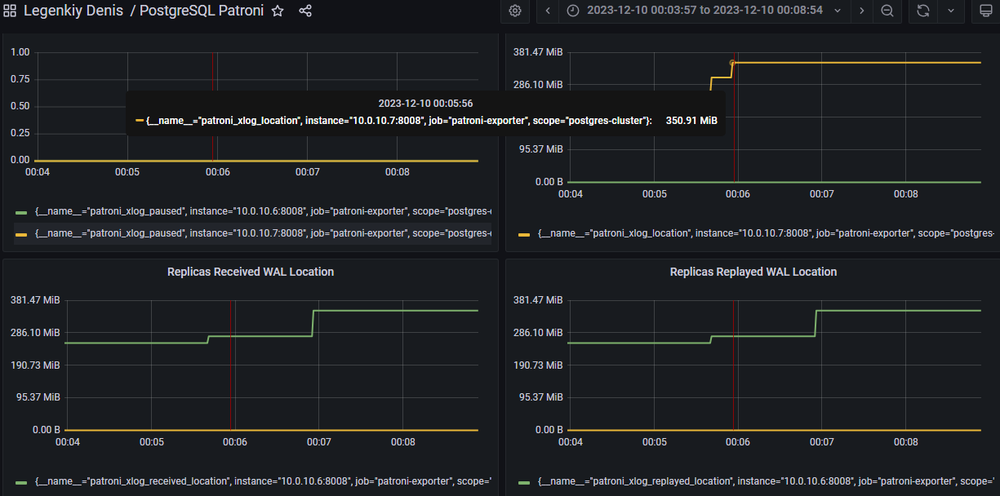
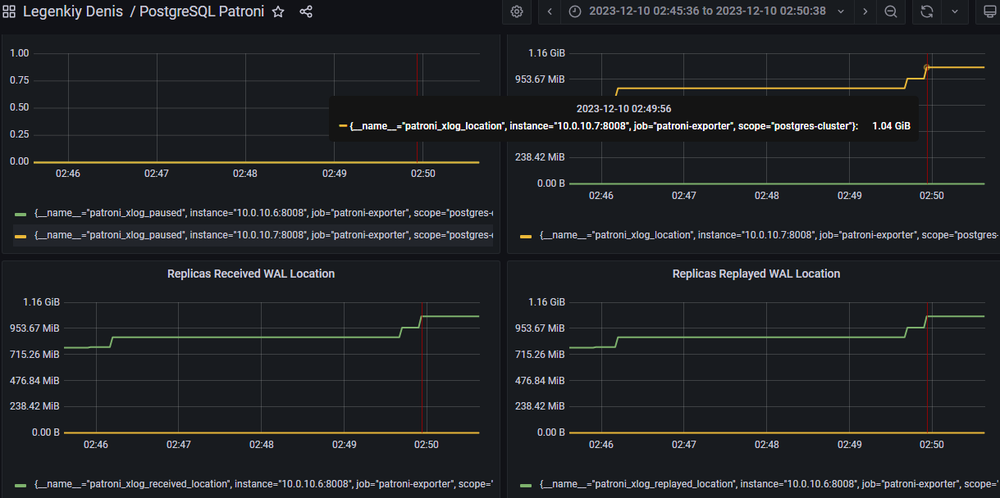
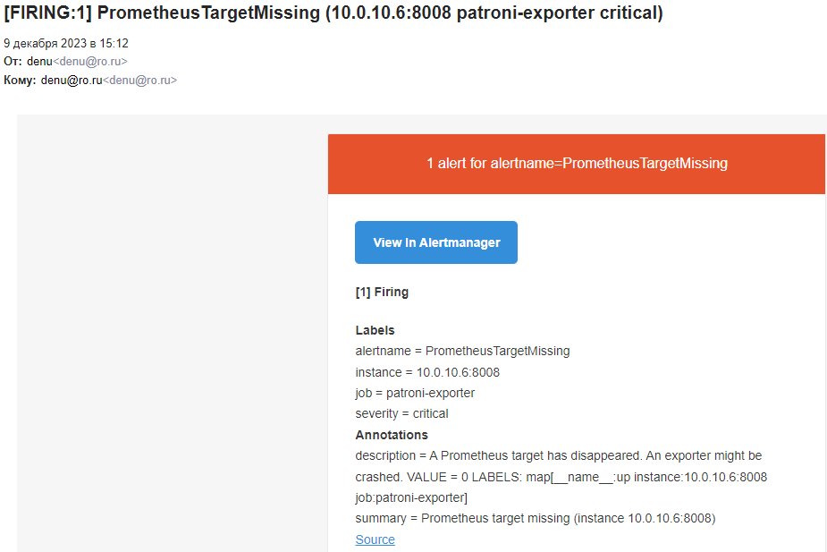
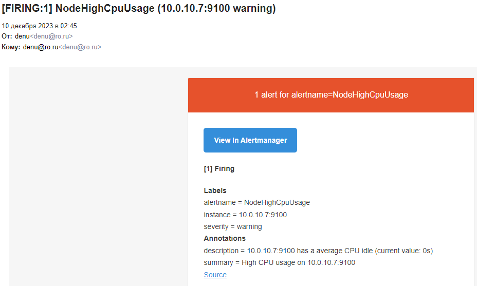

# Chaos Engineering

Эксперименты будем проводить на кластере БД, состоящем из двух рабочих узлов postgres/patroni - **pg-01** и **pg-02**, кластера etcd - **etcd-01**, **etcd-02**, **etcd-03** и балансировщика HA proxy - **ha-01**.


_Задание: 1. Отключение узла: Планово остановить один из узлов кластера, чтобы проверить процедуру переключения ролей (failover). - Анализировать время, необходимое для восстановления и как система выбирает новый Master узел (и есть ли вообще там стратегия выбора?)._

Проведем эксперимент с кластером БД.
Имитируем сбой на рабочем узле кластера БД, который в текущий момент является мастером. Для этого стандартными средствами linux (systemctl) остановим службу patroni.
Ожидаем, что узел кластера БД, который в текущий момент является репликой, обнаружит проблемы с мастером, инициируют процесс объявления себя мастером, и в результате станет новым мастером.
Подключаемся на один из узлов кластера - **pg-01**, и смотрим его текущий статус:

    sudo patronictl -c /etc/patroni/patroni.yml list

```
+ Cluster: postgres-cluster ---+-----------+----+-----------+
| Member | Host      | Role    | State     | TL | Lag in MB |
+--------+-----------+---------+-----------+----+-----------+
| pg-01  | 10.0.10.6 | Leader  | running   |  1 |           |
| pg-02  | 10.0.10.7 | Replica | streaming |  1 |         0 |
+--------+-----------+---------+-----------+----+-----------+
```
Видим, что кластер имеет два узла, **pg-01** - мастер. Остановим службу patroni на узле **pg-01**:

    sudo systemctl stop patroni

Проверяем статус кластера:

    sudo patronictl -c /etc/patroni/patroni.yml list

```
+ Cluster: postgres-cluster ---+---------+----+-----------+
| Member | Host      | Role    | State   | TL | Lag in MB |
+--------+-----------+---------+---------+----+-----------+
| pg-01  | 10.0.10.6 | Replica | stopped |    |   unknown |
| pg-02  | 10.0.10.7 | Leader  | running |  2 |           |
+--------+-----------+---------+---------+----+-----------+
```
Мастером стал узел **pg-02**. История смены мастера:

    sudo patronictl -c /etc/patroni/patroni.yml history

```
+----+-----------+------------------------------+----------------------------------+------------+
| TL |       LSN | Reason                       | Timestamp                        | New Leader |
+----+-----------+------------------------------+----------------------------------+------------+
|  1 | 150995104 | no recovery target specified | 2023-12-09T14:06:18.637187+03:00 | pg-02      |
+----+-----------+------------------------------+----------------------------------+------------+
```

Проанализируем процесс failover. Подключаемся на узел **pg-02** и посмотрим лог patroni:

    sudo cat /var/log/syslog | grep -i patroni
    
```
Dec  9 14:06:18 pg-02 patroni[9464]: 2023-12-09 14:06:18,235 INFO: no action. I am (pg-02), a secondary, and following a leader (pg-01)
Dec  9 14:06:18 pg-02 patroni[9464]: 2023-12-09 14:06:18,286 INFO: no action. I am (pg-02), a secondary, and following a leader (pg-01)
Dec  9 14:06:18 pg-02 patroni[9464]: 2023-12-09 14:06:18,441 WARNING: Request failed to pg-01: GET http://10.0.10.6:8008/patroni (HTTPConnectionPool(host='10.0.10.6', port=8008): Max retries exceeded with url: /patroni (Caused by ProtocolError('Connection aborted.', ConnectionResetError(104, 'Connection reset by peer'))))
Dec  9 14:06:18 pg-02 patroni[9464]: 2023-12-09 14:06:18,491 INFO: Software Watchdog activated with 25 second timeout, timing slack 15 seconds
Dec  9 14:06:18 pg-02 patroni[9464]: 2023-12-09 14:06:18,542 INFO: promoted self to leader by acquiring session lock
Dec  9 14:06:18 pg-02 patroni[9464]: 2023-12-09 14:06:18,543 INFO: Lock owner: pg-02; I am pg-02
Dec  9 14:06:18 pg-02 patroni[9464]: 2023-12-09 14:06:18,589 INFO: updated leader lock during promote
Dec  9 14:06:18 pg-02 patroni[3838902]: server promoting
Dec  9 14:06:19 pg-02 patroni[9464]: 2023-12-09 14:06:19,814 INFO: no action. I am (pg-02), the leader with the lock
Dec  9 14:06:29 pg-02 patroni[9464]: 2023-12-09 14:06:29,761 INFO: no action. I am (pg-02), the leader with the lock
Dec  9 14:06:39 pg-02 patroni[9464]: 2023-12-09 14:06:39,761 INFO: no action. I am (pg-02), the leader with the lock
Dec  9 14:06:49 pg-02 patroni[9464]: 2023-12-09 14:06:49,616 INFO: Lock owner: pg-02; I am pg-02
Dec  9 14:06:49 pg-02 patroni[9464]: 2023-12-09 14:06:49,712 INFO: Dropped unknown replication slot 'pg_01'
Dec  9 14:06:49 pg-02 patroni[9464]: 2023-12-09 14:06:49,761 INFO: no action. I am (pg-02), the leader with the lock
Dec  9 14:06:59 pg-02 patroni[9464]: 2023-12-09 14:06:59,665 INFO: no action. I am (pg-02), the leader with the lock
```
Из лога видно, что в 14:06:18 служба patroni на узле **pg-02** не смогла получить информацию с текущего мастера (_Request failed to pg-01: GET http://10.0.10.6:8008/patroni_), и был инициирован процесс объявления себя мастером (_promoted self to leader by acquiring session lock_).
Процесс завершился успешно, узел **pg-02** стал мастером (_updated leader lock during promote / server promoting_) в 14:06:18.
В данном сервисе только два рабочих узла кластера БД, и стратегия выбора нового мастера сводится к объявлению мастером оставшегося узла кластера.
В логе на **pg-01** смотрим время остановки службы patroni:

    sudo cat /var/log/syslog | grep -i patroni

```
Dec  9 14:05:57 pg-01 patroni[9430]: 2023-12-09 14:05:57,594 INFO: no action. I am (pg-01), the leader with the lock
Dec  9 14:06:07 pg-01 patroni[9430]: 2023-12-09 14:06:07,594 INFO: no action. I am (pg-01), the leader with the lock
Dec  9 14:06:17 pg-01 systemd[1]: Stopping Runners to orchestrate a high-availability PostgreSQL - Patroni...
Dec  9 14:06:18 pg-01 systemd[1]: patroni.service: Succeeded.
Dec  9 14:06:18 pg-01 systemd[1]: Stopped Runners to orchestrate a high-availability PostgreSQL - Patroni.
Dec  9 14:06:18 pg-01 systemd[1]: patroni.service: Consumed 1d 12h 51min 26.826s CPU time.
```
Получается в 14:06:17 поступил запрос на остановку службы кластера БД на текущем мастере **pg-01**, а в 14:06:18 узел кластера БД **pg-02** уже стал новым мастером. Время отработки failover около 1 секунды.

Запускаем службу patroni на **pg-01**:

    sudo systemctl start patroni

Проверяем статус кластера:
```
+ Cluster: postgres-cluster ---+-----------+----+-----------+
| Member | Host      | Role    | State     | TL | Lag in MB |
+--------+-----------+---------+-----------+----+-----------+
| pg-01  | 10.0.10.6 | Replica | streaming |  2 |         0 |
| pg-02  | 10.0.10.7 | Leader  | running   |  2 |           |
+--------+-----------+---------+-----------+----+-----------+
```
Узел **pg-01** стал репликой.

> Patroni имеет встроенный функционал для контролируемой смены мастера `patronictl failover` и `patronictl switchover`


_Задание: 2. Имитация частичной потери сети: Использовать инструменты для имитации потери пакетов
или разрыва TCP-соединений между узлами. Цель — проверить, насколько хорошо система
справляется с временной недоступностью узлов и как быстро восстанавливается репликация._

На узле реплике кластера БД имитируем потери пакетов сети. Ожидаем, что этот узел будет исключен из работы кластера и автоматически вернется в работу, когда работа сети нормализуется.
Для проведения эксперимента будем использовать инструмент [ChaosBlade](https://github.com/chaosblade-io/chaosblade).

Подключаемся на узел **pg-01**. Устанавливаем ChaosBlade:

    wget https://github.com/chaosblade-io/chaosblade/releases/download/v1.7.2/chaosblade-1.7.2-linux-amd64.tar.gz
    tar -xvf chaosblade-1.7.2-linux-amd64.tar.gz
    cd chaosblade-1.7.2
    ./blade version
    
Имитируем плохую связь с узлом **pg-02**, потери 40%:

    sudo ./blade create network corrupt --percent 40 --destination-ip 10.0.10.7 --interface ens160

Проверяем наличие потери пакетов:

    ping 10.0.10.7
    
Проверяем статус кластера:

    sudo patronictl -c /etc/patroni/patroni.yml list

```
+ Cluster: postgres-cluster ---+-----------+----+-----------+
| Member | Host      | Role    | State     | TL | Lag in MB |
+--------+-----------+---------+-----------+----+-----------+
| pg-01  | 10.0.10.6 | Replica | streaming |  2 |         0 |
| pg-02  | 10.0.10.7 | Leader  | running   |  2 |           |
+--------+-----------+---------+-----------+----+-----------+
```
Ничего не происходит. Сейчас наше приложение не создает нагрузку на БД, и реплицировать нечего. Добавим в БД тестовых данных:

    sudo PGPASSWORD=sre_password patronictl -c /etc/patroni/patroni.yml query -U sre_user -d sredatabase -r master -c "CREATE TABLE testtable (id serial, data text)"
    sudo PGPASSWORD=sre_password patronictl -c /etc/patroni/patroni.yml query -U sre_user -d sredatabase -r master -c "INSERT INTO testtable SELECT nextval('testtable_id_seq'::regclass), md5(generate_series(1,1000000)::text)"
    sudo PGPASSWORD=sre_password patronictl -c /etc/patroni/patroni.yml query -U sre_user -d sredatabase -r master -c "SELECT count(*) FROM testtable"

Повторим:

    sudo patronictl -c /etc/patroni/patroni.yml list

```
+ Cluster: postgres-cluster ---+-----------+----+-----------+
| Member | Host      | Role    | State     | TL | Lag in MB |
+--------+-----------+---------+-----------+----+-----------+
| pg-01  | 10.0.10.6 | Replica | streaming |  2 |        75 |
| pg-02  | 10.0.10.7 | Leader  | running   |  2 |           |
+--------+-----------+---------+-----------+----+-----------+
```
Появился лаг в 75Мб, но реплика продолжает работать.
В логе появилась ошибка, репликация перезапустилась:

    sudo tail /var/log/postgresql/postgresql-Sun.log

```
023-12-10 00:06:40 MSK [2814245-2]  FATAL:  terminating walreceiver due to timeout
2023-12-10 00:06:40 MSK [2802049-8]  LOG:  invalid magic number 0000 in log segment 000000020000000000000011, offset 4030464
2023-12-10 00:06:48 MSK [2847645-1]  LOG:  started streaming WAL from primary at 0/11000000 on timeline 2
```
Лаг обнулился:

    sudo patronictl -c /etc/patroni/patroni.yml list

```
+ Cluster: postgres-cluster ---+-----------+----+-----------+
| Member | Host      | Role    | State     | TL | Lag in MB |
+--------+-----------+---------+-----------+----+-----------+
| pg-01  | 10.0.10.6 | Replica | streaming |  2 |         0 |
| pg-02  | 10.0.10.7 | Leader  | running   |  2 |           |
+--------+-----------+---------+-----------+----+-----------+
```
По мониторингу видно задержку синхронизации реплики около 1 минуты.


Завершаем текущий эксперимент:

    sudo ./blade destroy "a5892363edb7b4ce" --force-remove

Увеличим количество потери пакетов до 90%:

    sudo ./blade create network corrupt --percent 90 --destination-ip 10.0.10.7 --interface ens160

Проверяем статус кластера:

    sudo patronictl -c /etc/patroni/patroni.yml list

```
+ Cluster: postgres-cluster ---+---------+----+-----------+
| Member | Host      | Role    | State   | TL | Lag in MB |
+--------+-----------+---------+---------+----+-----------+
| pg-01  | 10.0.10.6 | Replica | running |  2 |         1 |
| pg-02  | 10.0.10.7 | Leader  | running |  2 |           |
+--------+-----------+---------+---------+----+-----------+
```
Статус реплики на узле **pg-01** сменился со _streaming_ на _running_, т.е. postgres работает, но WALs не транслируются с мастера.
В логе ошибки репликации - не может соединиться с мастером:

    sudo tail /var/log/postgresql/postgresql-Sun.log

```
2023-12-10 00:32:32 MSK [2849647-2]  FATAL:  could not receive data from WAL stream: SSL connection has been closed unexpectedly
2023-12-10 00:33:22 MSK [2802047-13]  LOG:  restartpoint complete: wrote 8366 buffers (12.8%); 1 WAL file(s) added, 0 removed, 0 recycled; write=810.051 s, sync=0.002 s, total=810.089 s; sync files=25, longest=0.001 s, average=0.001 s; distance=98142 kB, estimate=98142 kB
2023-12-10 00:33:22 MSK [2802047-14]  LOG:  recovery restart point at 0/15EE8B70
2023-12-10 00:33:22 MSK [2802047-15]  DETAIL:  Last completed transaction was at log time 2023-12-10 00:05:43.219564+03.
2023-12-10 00:35:43 MSK [2850022-1]  FATAL:  could not connect to the primary server: connection to server at "10.0.10.7", port 5432 failed: SSL SYSCALL error: Success
        connection to server at "10.0.10.7", port 5432 failed: Connection timed out
                Is the server running on that host and accepting TCP/IP connections?
2023-12-10 00:37:00 MSK [2850320-1]  FATAL:  could not connect to the primary server: connection to server at "10.0.10.7", port 5432 failed: SSL connection has been closed unexpectedly
```
Добавим в БД тестовых данных:

    sudo PGPASSWORD=sre_password patronictl -c /etc/patroni/patroni.yml query -U sre_user -d sredatabase -r master -c "INSERT INTO testtable SELECT nextval('testtable_id_seq'::regclass), md5(generate_series(1,1000000)::text)"
    sudo PGPASSWORD=sre_password patronictl -c /etc/patroni/patroni.yml query -U sre_user -d sredatabase -r master -c "SELECT count(*) FROM testtable"

Повторим:

    sudo patronictl -c /etc/patroni/patroni.yml list

```
+ Cluster: postgres-cluster ---+---------+----+-----------+
| Member | Host      | Role    | State   | TL | Lag in MB |
+--------+-----------+---------+---------+----+-----------+
| pg-01  | 10.0.10.6 | Replica | running |  2 |       142 |
| pg-02  | 10.0.10.7 | Leader  | running |  2 |           |
+--------+-----------+---------+---------+----+-----------+
```

Через некоторое время статус не изменяется, реплика не может синхронизироваться, лаг не уменьшается - 142Мб.
Обращение к БД по порту 5000 (write/read) и 5001 (read only) возвращает разные данные, т.к. при обращении на порт 5001 они берутся с реплики:

    PGPASSWORD=sre_password psql -h 77.105.185.88 -p 5000 -d sredatabase -U sre_user  -c "SELECT count(*) FROM testtable"

```
  count
---------
 2000000
```

    PGPASSWORD=sre_password psql -h 77.105.185.88 -p 5001 -d sredatabase -U sre_user  -c "SELECT count(*) FROM testtable"
```  
  count
---------
 1000000
```
Восстанавливаем работоспособность сети:

    sudo ./blade destroy "c839175199afdda8" --force-remove

Через некоторое время, меньше минуты, статус реплики на узле **pg-01** сменился на streaming, лаг обнулился:
```
+ Cluster: postgres-cluster ---+-----------+----+-----------+
| Member | Host      | Role    | State     | TL | Lag in MB |
+--------+-----------+---------+-----------+----+-----------+
| pg-01  | 10.0.10.6 | Replica | streaming |  2 |         0 |
| pg-02  | 10.0.10.7 | Leader  | running   |  2 |           |
+--------+-----------+---------+-----------+----+-----------+
```
Реальный результат не полностью соответствует ожиданиям - при проблеме репликации узел не исключается из кластера, он может обслуживать клиентов, но его данные будут отставать от мастера. Поэтому при работе с БД на запись и на чтение по разным портам нужно контролировать лаг, например через API _GET /replica?lag=max-lag_.
В остальном система отработала хорошо, после устранения проблем с сетью, автоматически и быстро устранила отставание реплики от мастера.


_Задание: 3. Высокая нагрузка на CPU или I/O: Запустить процессы, которые создают высокую нагрузку на CPU или дисковую подсистему одного из узлов кластера, чтобы проверить, как это влияет на
производительность кластера в целом и на работу Patroni._

На узле мастере кластера БД нагружаем CPU. Ожидаем, что запросы к БД станут выполняться медленнее, но функциональность не пострадает.
Для проведения эксперимента будем использовать инструмент [ChaosBlade](https://github.com/chaosblade-io/chaosblade).
Подключаемся на узел **pg-02**. Устанавливаем ChaosBlade:

    wget https://github.com/chaosblade-io/chaosblade/releases/download/v1.7.2/chaosblade-1.7.2-linux-amd64.tar.gz
    tar -xvf chaosblade-1.7.2-linux-amd64.tar.gz
    cd chaosblade-1.7.2
    ./blade version

Проверяем статус кластера:

    sudo patronictl -c /etc/patroni/patroni.yml list

```
+ Cluster: postgres-cluster ---+-----------+----+-----------+
| Member | Host      | Role    | State     | TL | Lag in MB |
+--------+-----------+---------+-----------+----+-----------+
| pg-01  | 10.0.10.6 | Replica | streaming |  2 |         0 |
| pg-02  | 10.0.10.7 | Leader  | running   |  2 |           |
+--------+-----------+---------+-----------+----+-----------+
```
Добавим в БД тестовых данных и зафиксируем время выполнения:

    time sudo PGPASSWORD=sre_password patronictl -c /etc/patroni/patroni.yml query -U sre_user -d sredatabase -r master -c "INSERT INTO testtable SELECT nextval('testtable_id_seq'::regclass), md5(generate_series(1,1000000)::text)"

```
real    0m2.923s
user    0m0.431s
sys     0m0.025s
```

    time sudo PGPASSWORD=sre_password patronictl -c /etc/patroni/patroni.yml query -U sre_user -d sredatabase -r master -c "SELECT count(*) FROM testtable"

```
count
3000000
real    0m1.066s
user    0m0.469s
sys     0m0.037s
```
Загрузим все CPU на 100% в течении 40 секунд:

    sudo ./blade  create cpu fullload --timeout 40

Проверяем, что процессор загружен:

    top -b -n 2 | grep Cpu

```
%Cpu(s):100.0 us,  0.0 sy,  0.0 ni,  0.0 id,  0.0 wa,  0.0 hi,  0.0 si,  0.0 st
%Cpu(s): 99.3 us,  0.7 sy,  0.0 ni,  0.0 id,  0.0 wa,  0.0 hi,  0.0 si,  0.0 st
```
Добавим в БД тестовых данных:

    time sudo PGPASSWORD=sre_password patronictl -c /etc/patroni/patroni.yml query -U sre_user -d sredatabase -r master -c "INSERT INTO testtable SELECT nextval('testtable_id_seq'::regclass), md5(generate_series(1,1000000)::text)"

```
real    0m7.702s
user    0m0.536s
sys     0m0.038s
```

    time sudo PGPASSWORD=sre_password patronictl -c /etc/patroni/patroni.yml query -U sre_user -d sredatabase -r master -c "SELECT count(*) FROM testtable"

```
count
4000000
real    0m1.789s
user    0m0.509s
sys     0m0.017s
```
Время выполнения запроса на добавление данных выросло больше чем в 2 раза, время выполнения простого запроса на чтение возросло незначительно.

Увеличим время загрузки CPU на 100% до 10 минут:

    sudo ./blade  create cpu fullload --timeout 600

Проверяем статус кластера, все хорошо:

    sudo patronictl -c /etc/patroni/patroni.yml list 

```
+ Cluster: postgres-cluster ---+-----------+----+-----------+
| Member | Host      | Role    | State     | TL | Lag in MB |
+--------+-----------+---------+-----------+----+-----------+
| pg-01  | 10.0.10.6 | Replica | streaming |  2 |         0 |
| pg-02  | 10.0.10.7 | Leader  | running   |  2 |           |
+--------+-----------+---------+-----------+----+-----------+
```
Добавляем еще данных:

    time sudo PGPASSWORD=sre_password patronictl -c /etc/patroni/patroni.yml query -U sre_user -d sredatabase -r master -c "INSERT INTO testtable SELECT nextval('testtable_id_seq'::regclass), md5(generate_series(1,1000000)::text)"

```
real    0m8.333s
user    0m0.597s
sys     0m0.029s
---
real    0m10.194s
user    0m0.613s
sys     0m0.059s
```

    time sudo PGPASSWORD=sre_password patronictl -c /etc/patroni/patroni.yml query -U sre_user -d sredatabase -r master -c "SELECT count(*) FROM testtable"

```
count
5000000
real    0m2.195s
user    0m0.711s
sys     0m0.006s
---
count
7000000
real    0m2.230s
user    0m0.556s
sys     0m0.021s
```
БД работает, репликация работает:
```
+ Cluster: postgres-cluster ---+-----------+----+-----------+
| Member | Host      | Role    | State     | TL | Lag in MB |
+--------+-----------+---------+-----------+----+-----------+
| pg-01  | 10.0.10.6 | Replica | streaming |  2 |         0 |
| pg-02  | 10.0.10.7 | Leader  | running   |  2 |           |
+--------+-----------+---------+-----------+----+-----------+
```
По мониторингу задержек репликации нет.



_Задание: 4. Тестирование систем мониторинга и оповещения: С помощью chaos engineering можно также
проверить, насколько эффективны системы мониторинга и оповещения. Например, можно
искусственно вызвать отказ, который должен быть зарегистрирован системой мониторинга, и
убедиться, что оповещения доставляются вовремя?_

Проведенные эксперименты chaos engineering вызвали срабатывание оповещения системы мониторинга:


